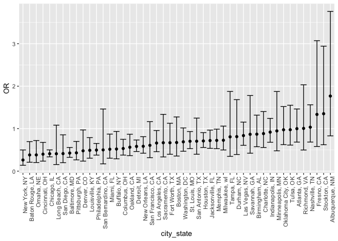
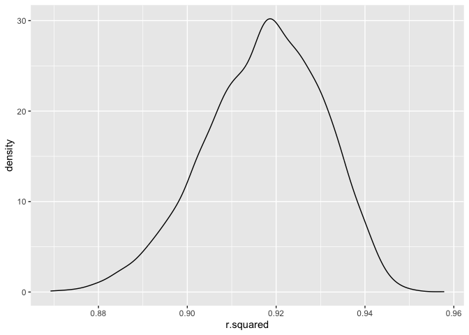
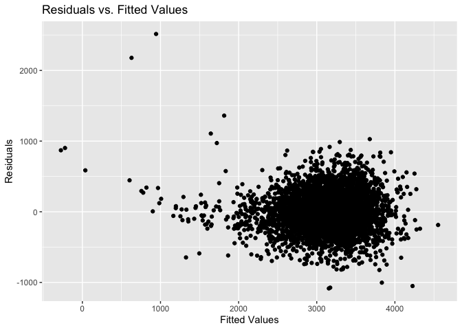
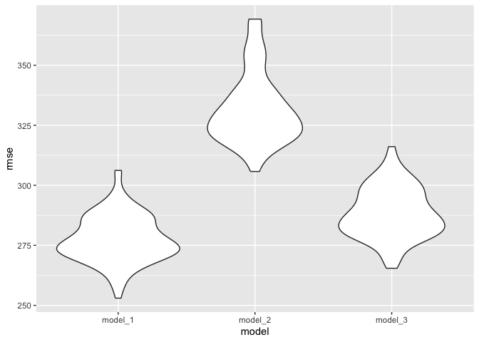

p8105_hw6_xt2299.Rmd
================
Xiaoting Tang
2023-11-30

``` r
library(tidyverse)
```

    ## ── Attaching core tidyverse packages ──────────────────────── tidyverse 2.0.0 ──
    ## ✔ dplyr     1.1.3     ✔ readr     2.1.4
    ## ✔ forcats   1.0.0     ✔ stringr   1.5.0
    ## ✔ ggplot2   3.4.3     ✔ tibble    3.2.1
    ## ✔ lubridate 1.9.2     ✔ tidyr     1.3.0
    ## ✔ purrr     1.0.2     
    ## ── Conflicts ────────────────────────────────────────── tidyverse_conflicts() ──
    ## ✖ dplyr::filter() masks stats::filter()
    ## ✖ dplyr::lag()    masks stats::lag()
    ## ℹ Use the conflicted package (<http://conflicted.r-lib.org/>) to force all conflicts to become errors

``` r
library(modelr)
```

# Problem 1

data cleaning

``` r
homicide= 
  read_csv("data/homicide-data.csv") |>
  mutate(
    city_state = str_c(city, state, sep = ", "),
    solve_not = case_match(
      disposition,
      "Closed without arrest" ~ 0,
      "Open/No arrest"        ~ 0,
      "Closed by arrest"      ~ 1) 
    ) |>
  filter(!(city_state %in% c("Tulsa, AL", "Dallas, TX", "Phoenix, AZ", "Kansas City, MO"))) |>
  filter(victim_race %in% c("White", "Black")) |> 
  mutate(
    victim_age = as.numeric(victim_age)
  ) |>
  select(city_state, solve_not, victim_age, victim_sex, victim_race)
```

    ## Rows: 52179 Columns: 12
    ## ── Column specification ────────────────────────────────────────────────────────
    ## Delimiter: ","
    ## chr (9): uid, victim_last, victim_first, victim_race, victim_age, victim_sex...
    ## dbl (3): reported_date, lat, lon
    ## 
    ## ℹ Use `spec()` to retrieve the full column specification for this data.
    ## ℹ Specify the column types or set `show_col_types = FALSE` to quiet this message.

    ## Warning: There was 1 warning in `mutate()`.
    ## ℹ In argument: `victim_age = as.numeric(victim_age)`.
    ## Caused by warning:
    ## ! NAs introduced by coercion

Baltimore glm function

``` r
baltimore_glm = 
  filter(homicide, city_state == "Baltimore, MD") |> 
  glm(solve_not ~ victim_age + victim_sex + victim_race, family = binomial(), data = _)
```

estimate and confidence interval of the adjusted odds ratio

``` r
baltimore_glm |> 
  broom::tidy() |> 
  mutate(
    OR = exp(estimate), 
    OR_CI_upper = exp(estimate + 1.96 * std.error),
    OR_CI_lower = exp(estimate - 1.96 * std.error)) |> 
  filter(term == "victim_sexMale") |> 
  select(OR, OR_CI_lower, OR_CI_upper) |>
  knitr::kable(digits = 3)
```

|    OR | OR_CI_lower | OR_CI_upper |
|------:|------------:|------------:|
| 0.426 |       0.325 |       0.558 |

estimated ORs and CIs for each city.

``` r
all_cities = 
  homicide |>
  nest(data = -city_state) |> 
  mutate(
    models = map(data, \(df) glm(solve_not ~ victim_age + victim_sex + victim_race, 
                             family = binomial(), data = df)),
    tidy_models = map(models, broom::tidy)) |> 
  select(-models, -data) |> 
  unnest(cols = tidy_models) |> 
  mutate(
    OR = exp(estimate), 
    OR_CI_upper = exp(estimate + 1.96 * std.error),
    OR_CI_lower = exp(estimate - 1.96 * std.error)) |> 
  filter(term == "victim_sexMale") |> 
  select(city_state, OR, OR_CI_lower, OR_CI_upper)

all_cities |>
  slice(1:5) |> 
  knitr::kable(digits = 3)
```

| city_state      |    OR | OR_CI_lower | OR_CI_upper |
|:----------------|------:|------------:|------------:|
| Albuquerque, NM | 1.767 |       0.831 |       3.761 |
| Atlanta, GA     | 1.000 |       0.684 |       1.463 |
| Baltimore, MD   | 0.426 |       0.325 |       0.558 |
| Baton Rouge, LA | 0.381 |       0.209 |       0.695 |
| Birmingham, AL  | 0.870 |       0.574 |       1.318 |

plot

``` r
all_cities |> 
  mutate(city_state = fct_reorder(city_state, OR)) |> 
  ggplot(aes(x = city_state, y = OR)) + 
  geom_point() + 
  geom_errorbar(aes(ymin = OR_CI_lower, ymax = OR_CI_upper)) + 
  theme(axis.text.x = element_text(angle = 90, hjust = 1))
```

<!-- -->

In most cities, male victims have smaller odds than female victims as
the odds ratio is smaller than 1. In roughly half of these cities,
confidence intervals are narrow and do not contain 1, suggesting a
significant difference in resolution rates by sex after adjustment for
victim age and race.

# Problem 2

``` r
weather_df = 
  rnoaa::meteo_pull_monitors(
    c("USW00094728"),
    var = c("PRCP", "TMIN", "TMAX"), 
    date_min = "2022-01-01",
    date_max = "2022-12-31") |>
  mutate(
    name = recode(id, USW00094728 = "CentralPark_NY"),
    tmin = tmin / 10,
    tmax = tmax / 10) |>
  select(name, id, everything())
```

    ## using cached file: /Users/racheltang/Library/Caches/org.R-project.R/R/rnoaa/noaa_ghcnd/USW00094728.dly

    ## date created (size, mb): 2023-09-28 10:20:22.378772 (8.524)

    ## file min/max dates: 1869-01-01 / 2023-09-30

create the df with estimates

``` r
weather_data_df = weather_df |> 
  modelr::bootstrap(n = 5000) |> 
  mutate(
    models = map(strap, \(df) lm(tmax ~ tmin + prcp, data = df)),
    r2 = map(models, broom::glance),
    results = map(models, broom::tidy)) |>
  select(.id,results,r2) |> 
  unnest(r2, results) |>
  select(.id, r.squared, term, estimate) |>
  pivot_wider(
    names_from = term,
    values_from = estimate
  ) |>
  mutate(
    log_b1_b2 = log(tmin * prcp)
  ) |>
  select(.id, r.squared, log_b1_b2)
```

    ## Warning: `unnest()` has a new interface. See `?unnest` for details.
    ## ℹ Try `df %>% unnest(c(r2, results))`, with `mutate()` if needed.

    ## Warning: There was 1 warning in `mutate()`.
    ## ℹ In argument: `log_b1_b2 = log(tmin * prcp)`.
    ## Caused by warning in `log()`:
    ## ! NaNs produced

Plot the distribution of ${r^2}$

``` r
weather_data_df |>
  ggplot(aes(x = r.squared)) +
  geom_density()
```

<!-- -->

The distribution of ${r^2}$ is normal, centered around 0.920.

Plot the distribution of log($\hat{\beta_1} * \hat{\beta_2}$)

``` r
weather_data_df |>
  ggplot(aes(x = log_b1_b2)) +
  geom_density()
```

    ## Warning: Removed 3379 rows containing non-finite values (`stat_density()`).

<!-- -->

67.58% is NA. After removed these NAs. The distribution of
log($\hat{\beta_1} * \hat{\beta_2}$) is left-skewed.

Here is the 95% confidence interval for ${r^2}$.

``` r
quantile(pull(weather_data_df, r.squared), probs = c(0.025, 0.975))
```

    ##      2.5%     97.5% 
    ## 0.8892995 0.9402040

Here is the 95% confidence interval for
log($\hat{\beta_1} * \hat{\beta_2}$) after removing the NAs.

``` r
quantile(pull(weather_data_df, log_b1_b2), probs = c(0.025, 0.975), na.rm = TRUE)
```

    ##      2.5%     97.5% 
    ## -8.979367 -4.517644

# Problem 3

load and clean the data

``` r
birthweight = read_csv("data/birthweight.csv") |>
  mutate(babysex = 
           case_match(
             babysex,
             1 ~ "male",
             2 ~ "female"),
         babysex = as.factor(babysex),
         frace = 
           case_match(
             frace,
             1 ~ "White", 
             2 ~ "Black", 
             3 ~ "Asian", 
             4 ~ "Puerto Rican", 
             8 ~ "Other", 
             9 ~ "Unknown"),
         frace = as.factor(frace),
         malform = 
           case_match(
             malform,
             0 ~ "absent",
             1 ~ "present"),
         malform = as.factor(malform),
         mrace = 
           case_match(
             mrace,
             1 ~ "White", 
             2 ~ "Black", 
             3 ~ "Asian", 
             4 ~ "Puerto Rican", 
             8 ~ "Other"),
         mrace = as.factor(mrace)
         ) |>
  drop_na()
```

    ## Rows: 4342 Columns: 20
    ## ── Column specification ────────────────────────────────────────────────────────
    ## Delimiter: ","
    ## dbl (20): babysex, bhead, blength, bwt, delwt, fincome, frace, gaweeks, malf...
    ## 
    ## ℹ Use `spec()` to retrieve the full column specification for this data.
    ## ℹ Specify the column types or set `show_col_types = FALSE` to quiet this message.

regression model

``` r
reg_model = lm(bwt ~ ., data = birthweight)

bwt_model = lm(bwt ~ babysex + bhead + blength + delwt + fincome + gaweeks +mheight + momage + parity + ppwt + smoken, data = birthweight)

# summary(bwt_model)
```

I first use all variables as predictors. By checking the p-values for
each predictor, the greatest one will be dropped, as it means the
predictor is not significant. Repeat this step, until all predictos have
a p-value less than 0.05.

plot of model residuals against fitted values

``` r
birthweight |>
  add_predictions(bwt_model) |>
  add_residuals(bwt_model) |>
  ggplot(aes(x = pred, y = resid)) + 
  geom_point() +
  labs(title = "Residuals vs. Fitted Values",
       x = "Fitted Values",
       y = "Residuals")
```

<!-- -->

The points are gatherd in the region of 2000-4000 fitted values and
-1000-1000 residuals. There is no clear pattern.

make two other models

``` r
model_2 = lm(bwt ~ blength + gaweeks, data = birthweight)
model_3 = lm(bwt ~ bhead * blength * babysex, data = birthweight)
```

make comparison

``` r
cv_df = 
  crossv_mc(birthweight, 100) |>
  mutate(
    train = map(train, as_tibble),
    test = map(test, as_tibble)) |>
   mutate(
    model_1  = map(train, \(df) lm(bwt ~ babysex + bhead + blength + delwt + fincome + gaweeks +mheight + momage + parity + ppwt + smoken, data = df)),
    model_2  = map(train, \(df) lm(bwt ~ blength + gaweeks, data = df)),
    model_3  = map(train, \(df) lm(bwt ~ bhead * blength * babysex, data = df))) |> 
  mutate(
    rmse_model_1 = map2_dbl(model_1, test, \(mod, df) rmse(model = mod, data = df)),
    rmse_model_2 = map2_dbl(model_2, test, \(mod, df) rmse(model = mod, data = df)),
    rmse_model_3 = map2_dbl(model_3, test, \(mod, df) rmse(model = mod, data = df)))

cv_df |>
  select(starts_with("rmse")) |> 
  pivot_longer(
    everything(),
    names_to = "model", 
    values_to = "rmse",
    names_prefix = "rmse_") |> 
  mutate(model = fct_inorder(model)) |> 
  ggplot(aes(x = model, y = rmse)) + 
  geom_violin()
```

<!-- -->

RMSE is used to compared these three models. And the violin shape for
the distribution of RMSE for each model is plotted. The first model has
the smallest rmse and variance, which means it is preferred.
