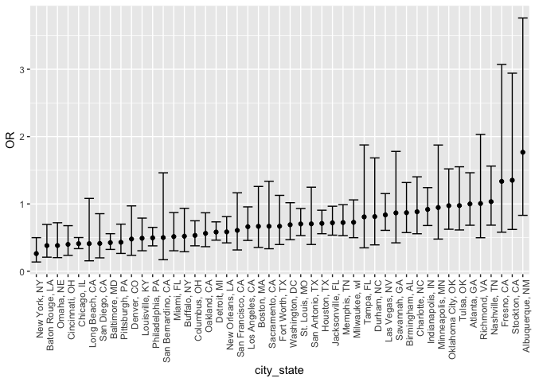
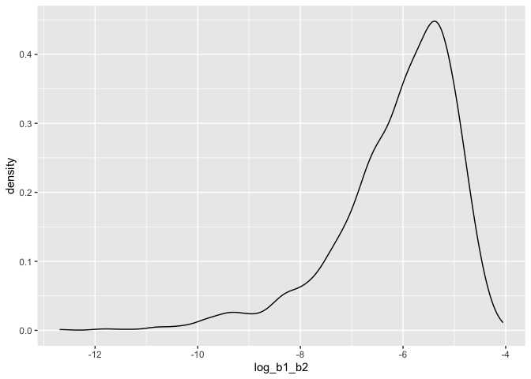

p8105_hw6_xt2299.Rmd
================
Xiaoting Tang
2023-11-28

``` r
library(tidyverse)
```

    ## ── Attaching core tidyverse packages ──────────────────────── tidyverse 2.0.0 ──
    ## ✔ dplyr     1.1.3     ✔ readr     2.1.4
    ## ✔ forcats   1.0.0     ✔ stringr   1.5.0
    ## ✔ ggplot2   3.4.3     ✔ tibble    3.2.1
    ## ✔ lubridate 1.9.2     ✔ tidyr     1.3.0
    ## ✔ purrr     1.0.2     
    ## ── Conflicts ────────────────────────────────────────── tidyverse_conflicts() ──
    ## ✖ dplyr::filter() masks stats::filter()
    ## ✖ dplyr::lag()    masks stats::lag()
    ## ℹ Use the conflicted package (<http://conflicted.r-lib.org/>) to force all conflicts to become errors

``` r
library(modelr)
```

# Problem 1

In the data cleaning code below we create a `city_state` variable,
change `victim_age` to numeric, modifiy victim_race to have categories
white and non-white, with white as the reference category, and create a
`resolution` variable indicating whether the homicide is solved. Lastly,
we filtered out the following cities: Tulsa, AL; Dallas, TX; Phoenix,
AZ; and Kansas City, MO; and we retained only the variables
`city_state`, `resolution`, `victim_age`, `victim_sex`, and
`victim_race`.

``` r
homicide_df = 
  read_csv("data/homicide-data.csv", na = c("", "NA", "Unknown")) |> 
  mutate(
    city_state = str_c(city, state, sep = ", "),
    victim_age = as.numeric(victim_age),
    resolution = case_when(
      disposition == "Closed without arrest" ~ 0,
      disposition == "Open/No arrest"        ~ 0,
      disposition == "Closed by arrest"      ~ 1)
  ) |> 
  filter(victim_race %in% c("White", "Black")) |> 
  filter(!(city_state %in% c("Tulsa, AL", "Dallas, TX", "Phoenix, AZ", "Kansas City, MO"))) |> 
  select(city_state, resolution, victim_age, victim_sex, victim_race)
```

    ## Rows: 52179 Columns: 12
    ## ── Column specification ────────────────────────────────────────────────────────
    ## Delimiter: ","
    ## chr (8): uid, victim_last, victim_first, victim_race, victim_sex, city, stat...
    ## dbl (4): reported_date, victim_age, lat, lon
    ## 
    ## ℹ Use `spec()` to retrieve the full column specification for this data.
    ## ℹ Specify the column types or set `show_col_types = FALSE` to quiet this message.

Next we fit a logistic regression model using only data from Baltimore,
MD. We model `resolved` as the outcome and `victim_age`, `victim_sex`,
and `victim_race` as predictors. We save the output as `baltimore_glm`
so that we can apply `broom::tidy` to this object and obtain the
estimate and confidence interval of the adjusted odds ratio for solving
homicides comparing non-white victims to white victims.

``` r
baltimore_glm = 
  filter(homicide_df, city_state == "Baltimore, MD") |> 
  glm(resolution ~ victim_age + victim_sex + victim_race, family = binomial(), data = _)

baltimore_glm |> 
  broom::tidy() |> 
  mutate(
    OR = exp(estimate), 
    OR_CI_upper = exp(estimate + 1.96 * std.error),
    OR_CI_lower = exp(estimate - 1.96 * std.error)) |> 
  filter(term == "victim_sexMale") |> 
  select(OR, OR_CI_lower, OR_CI_upper) |>
  knitr::kable(digits = 3)
```

|    OR | OR_CI_lower | OR_CI_upper |
|------:|------------:|------------:|
| 0.426 |       0.325 |       0.558 |

Below, by incorporating `nest()`, `map()`, and `unnest()` into the
preceding Baltimore-specific code, we fit a model for each of the
cities, and extract the adjusted odds ratio (and CI) for solving
homicides comparing non-white victims to white victims. We show the
first 5 rows of the resulting dataframe of model results.

``` r
model_results = 
  homicide_df |> 
  nest(data = -city_state) |> 
  mutate(
    models = map(data, \(df) glm(resolution ~ victim_age + victim_sex + victim_race, 
                             family = binomial(), data = df)),
    tidy_models = map(models, broom::tidy)) |> 
  select(-models, -data) |> 
  unnest(cols = tidy_models) |> 
  mutate(
    OR = exp(estimate), 
    OR_CI_upper = exp(estimate + 1.96 * std.error),
    OR_CI_lower = exp(estimate - 1.96 * std.error)) |> 
  filter(term == "victim_sexMale") |> 
  select(city_state, OR, OR_CI_lower, OR_CI_upper)

model_results |>
  slice(1:5) |> 
  knitr::kable(digits = 3)
```

| city_state      |    OR | OR_CI_lower | OR_CI_upper |
|:----------------|------:|------------:|------------:|
| Albuquerque, NM | 1.767 |       0.831 |       3.761 |
| Atlanta, GA     | 1.000 |       0.684 |       1.463 |
| Baltimore, MD   | 0.426 |       0.325 |       0.558 |
| Baton Rouge, LA | 0.381 |       0.209 |       0.695 |
| Birmingham, AL  | 0.870 |       0.574 |       1.318 |

Below we generate a plot of the estimated ORs and CIs for each city,
ordered by magnitude of the OR from smallest to largest. From this plot
we see that most cities have odds ratios that are smaller than 1,
suggesting that crimes with male victims have smaller odds of resolution
compared to crimes with female victims after adjusting for victim age
and race. This disparity is strongest in New yrok. In roughly half of
these cities, confidence intervals are narrow and do not contain 1,
suggesting a significant difference in resolution rates by sex after
adjustment for victim age and race.

``` r
model_results |> 
  mutate(city_state = fct_reorder(city_state, OR)) |> 
  ggplot(aes(x = city_state, y = OR)) + 
  geom_point() + 
  geom_errorbar(aes(ymin = OR_CI_lower, ymax = OR_CI_upper)) + 
  theme(axis.text.x = element_text(angle = 90, hjust = 1))
```

<!-- -->

# Problem 2

``` r
weather_df = 
  rnoaa::meteo_pull_monitors(
    c("USW00094728"),
    var = c("PRCP", "TMIN", "TMAX"), 
    date_min = "2022-01-01",
    date_max = "2022-12-31") |>
  mutate(
    name = recode(id, USW00094728 = "CentralPark_NY"),
    tmin = tmin / 10,
    tmax = tmax / 10) |>
  select(name, id, everything())
```

    ## using cached file: /Users/racheltang/Library/Caches/org.R-project.R/R/rnoaa/noaa_ghcnd/USW00094728.dly

    ## date created (size, mb): 2023-09-28 10:20:22.378772 (8.524)

    ## file min/max dates: 1869-01-01 / 2023-09-30

create the df with estimates

``` r
weather_data_df = weather_df |> 
  modelr::bootstrap(n = 5000) |> 
  mutate(
    models = map(strap, \(df) lm(tmax ~ tmin + prcp, data = df)),
    r2 = map(models, broom::glance),
    results = map(models, broom::tidy)) |>
  select(.id,results,r2) |> 
  unnest(r2, results) |>
  select(.id, r.squared, term, estimate) |>
  pivot_wider(
    names_from = term,
    values_from = estimate
  ) |>
  mutate(
    log_b1_b2 = log(tmin * prcp)
  ) |>
  select(.id, r.squared, log_b1_b2)
```

    ## Warning: `unnest()` has a new interface. See `?unnest` for details.
    ## ℹ Try `df %>% unnest(c(r2, results))`, with `mutate()` if needed.

    ## Warning: There was 1 warning in `mutate()`.
    ## ℹ In argument: `log_b1_b2 = log(tmin * prcp)`.
    ## Caused by warning in `log()`:
    ## ! NaNs produced

Plot the distribution of ${r^2}$

``` r
weather_data_df |>
  ggplot(aes(x = r.squared)) +
  geom_density()
```

<!-- -->

The distribution of ${r^2}$ is normal, centered around 0.920.

Plot the distribution of log($\hat{\beta_1} * \hat{\beta_2}$)

``` r
weather_data_df |>
  ggplot(aes(x = log_b1_b2)) +
  geom_density()
```

    ## Warning: Removed 3322 rows containing non-finite values (`stat_density()`).

<!-- -->

66.44% is NA. After removed these NAs. The distribution of
log($\hat{\beta_1} * \hat{\beta_2}$) is left-skewed.

Here is the 95% confidence interval for ${r^2}$.

``` r
quantile(pull(weather_data_df, r.squared), probs = c(0.025, 0.975))
```

    ##      2.5%     97.5% 
    ## 0.8879077 0.9408722

Here is the 95% confidence interval for
log($\hat{\beta_1} * \hat{\beta_2}$) after removing the NAs.

``` r
quantile(pull(weather_data_df, log_b1_b2), probs = c(0.025, 0.975), na.rm = TRUE)
```

    ##      2.5%     97.5% 
    ## -8.903609 -4.579813

# Problem 3

load and clean the data

``` r
birthweight = read_csv("data/birthweight.csv") |>
  mutate(babysex = 
           case_match(
             babysex,
             1 ~ "male",
             2 ~ "female"),
         babysex = as.factor(babysex),
         frace = 
           case_match(
             frace,
             1 ~ "White", 
             2 ~ "Black", 
             3 ~ "Asian", 
             4 ~ "Puerto Rican", 
             8 ~ "Other", 
             9 ~ "Unknown"),
         frace = as.factor(frace),
         malform = 
           case_match(
             malform,
             0 ~ "absent",
             1 ~ "present"),
         malform = as.factor(malform),
         mrace = 
           case_match(
             mrace,
             1 ~ "White", 
             2 ~ "Black", 
             3 ~ "Asian", 
             4 ~ "Puerto Rican", 
             8 ~ "Other"),
         mrace = as.factor(mrace)
         )
```

    ## Rows: 4342 Columns: 20
    ## ── Column specification ────────────────────────────────────────────────────────
    ## Delimiter: ","
    ## dbl (20): babysex, bhead, blength, bwt, delwt, fincome, frace, gaweeks, malf...
    ## 
    ## ℹ Use `spec()` to retrieve the full column specification for this data.
    ## ℹ Specify the column types or set `show_col_types = FALSE` to quiet this message.

regression model

``` r
reg_model = lm(bwt ~ ., data = birthweight)

bwt_model = lm(bwt ~ babysex + bhead + blength + delwt + fincome + gaweeks +mheight + momage + parity + ppwt + smoken, data = birthweight)

# summary(bwt_model)
```

I first use all variables as predictors. By checking the p-values for
each predictor, the greatest one will be dropped, as it means the
predictor is not significant. Repeat this step, until all predictos have
a p-value less than 0.05.

plot of model residuals against fitted values

``` r
birthweight |>
  add_predictions(bwt_model) |>
  add_residuals(bwt_model) |>
  ggplot(aes(x = pred, y = resid)) + 
  geom_point() +
  labs(title = "Residuals vs. Fitted Values",
       x = "Fitted Values",
       y = "Residuals")
```

<!-- -->

The points are gatherd in the region of 2000-4000 fitted values and
-1000-1000 residuals.

Compare your model to two others:

One using length at birth and gestational age as predictors (main
effects only) One using head circumference, length, sex, and all
interactions (including the three-way interaction) between these Make
this comparison in terms of the cross-validated prediction error; use
crossv_mc and functions in purrr as appropriate.

Note that although we expect your model to be reasonable, model building
itself is not a main idea of the course and we don’t necessarily expect
your model to be “optimal”.
